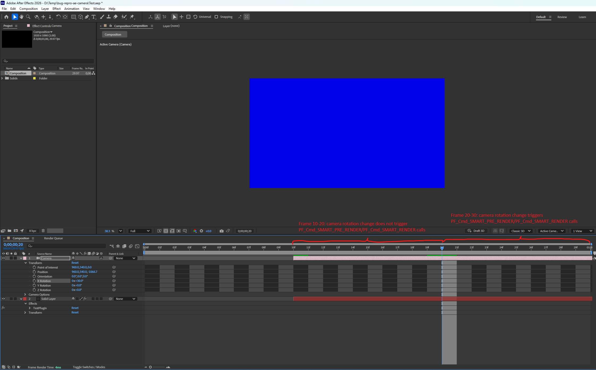

# After Effects Camera Bug Reproduce

## Build Instructions
1. Build the project (VS2022 required)
2. Copy the `Binaries\TestPlugin\x64\Debug\TestPlugin.aex` to the After Effects plugins folder (usually located at `C:\Program Files\Adobe\Common\Plug-ins\7.0\MediaCore`)
3. Open `Test.aep` test project (After Effects 2026 project)

## Test Plugin
The test plugin is a simple After Effects plugin that converts camera rotation into a color and fills the effect canvas with that color. The color is updated in real-time as the camera rotates due to `PF_OutFlag2_I_USE_3D_CAMERA` flag set.

## The Bug
When the camera layer starts at a non-zero position, the color fill effect does not update correctly.  

In the test After Effects project, both the camera layer and the effect layer start at frame 10.
When the camera rotation changes and we select frames 20-30, the PF_Cmd_SMART_PRE_RENDER/PF_Cmd_SMART_RENDER plugin events are fired as expected. But when frames 10-20 are selected, the plugin does not receive the `PF_Cmd_SMART_PRE_RENDER`/`PF_Cmd_SMART_RENDER` events and thus the color fill effect does not update. The number of "broken" frames is equal to the camera layer's offset from frame 0.  

Reproducible with:
- After Effects 25.1.0
- After Effects 26.0.0

